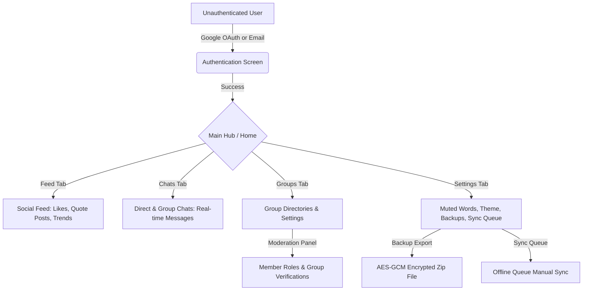

# Product Requirements Document (PRD) — ChattingApp

This Product Requirements Document (PRD) outlines the product vision, core user personas, feature definitions, and user flows for **ChattingApp**, a high-performance, secure, real-time social chatting application built for multi-user collaboration and native Android compatibility.

---

## 1. Problem Statement
Modern chat and social applications are often either:
- **Centralized and privacy-invasive**, selling user data or failing to offer robust local-first encryption, OR
- **Cumbersome and lacks standard social feed/community building capabilities**, making it hard for users to build networks, create posts, share media, or collaborate in groups.

**ChattingApp** solves this by providing a premium, unified experience combining:
1. **Real-time communication** (scalable direct messaging and group chat rooms).
2. **Social graph and feed features** (posts, comments, likes, reposts, quote posts, and trending tags).
3. **Advanced local-first security** (Web Crypto AES-GCM encrypted local backups and IndexedDB storage).
4. **Native Android wrapped assembly** via Capacitor, enabling smooth cross-platform performance.

---

## 2. Target Users
- **Privacy-Conscious Communicators**: Users who demand full data ownership, local encrypted backups, and transparent data policies without losing rich media features.
- **Dynamic Community Organizers**: Users who manage group channels, schedule events, verify profiles/communities, and moderate conversations.
- **On-the-go Mobile Users**: Users who expect a fluid, native-like app experience on their Android devices with offline recovery and low battery usage.

---

## 3. Product Vision
To become the premier secure, decentralized-ready communication and social networking hub that balances high-utility messaging with premium aesthetics, offline independence, and total data sovereignty.

---

## 4. Core Features

### Must-Have (MVP / Current Release)
- **Firebase Authentication & Session Management**: Secure login/registration via email and password or Google OAuth, with multi-device session/MFA controls.
- **Real-Time Direct & Group Messaging**: Immediate message delivery via WebSockets synchronized through a Redis Pub/Sub backend.
- **Social Feed & Quote Posts**: A personalized posts feed featuring infinite cursor-pagination, media attachments, comments, likes, reposts, and nested quote posts.
- **Local-First Synchronization**: IndexedDB local database layer wrapping drafts, settings, messages, and a durable offline sync queue.
- **Encrypted Backup & Restore**: Web Crypto AES-GCM encrypted backup archives with passphrase-derived keys and tamper verification.
- **Group Moderation & Roles**: Granular roles (Owner, Admin, Moderator, Member) with permissions to moderate, approve verifications, and adjust role levels.
- **Media Optimization Pipeline**: Image compression to WebP, voice note transcoding to MP3, and file signature validation.

### Nice-to-Have (Future Versions / Backlog)
- **End-to-End Encryption (E2E) by Default**: Full signal-protocol direct message encryption (currently E2E metadata and encrypted backups are supported).
- **WebRTC Voice & Video SFU calls**: Live group video calls with screen sharing (currently WebRTC readiness audit is completed).
- **Mohalla Connect Proximity Geofencing**: Proximity-based public feed post querying using PostGIS coordinates.
- **Subscriptions & Monetization**: Staging billing system allowing creators to charge for exclusive group access.

---

## 5. App Flow

1. **Onboarding / Authentication**: User signs up or logs in. FastAPI validates tokens against Firebase Admin.
2. **Main Hub**: User lands on the centered desktop shell or responsive mobile bottom layout.
3. **Real-time Chat**: User enters a chat room; WebSocket connection established. Typing and read indicators sync in real time.
4. **Social Feed Interaction**: User creates a post or quotes another post. The backend parses mentions and hashtags, updating the right sidebar trends.
5. **Settings & Data Management**: User opens settings to toggle Dark Mode, manage active sessions, clear cache, or run an encrypted backup export.

---

## 6. Success Metrics
- **Message Delivery Latency**: <100ms for WebSocket fanout across multiple instances.
- **Sync Reliability**: 100% of offline requests queued in IndexedDB successfully synced upon network restoration.
- **Page Load Performance**: Lighthouse performance score >90, with React bundle size <250KB.
- **Test Stability**: 100% pass rate on backend and frontend unit/integration test suites.

---

## 7. Out of Scope (Version 1)
- **Hosted SFU Server Infrastructure**: Production WebRTC calls will rely on external TURN/STUN servers; building a dedicated SFU server is out of scope for V1.
- **Native Android Java Plugins**: Capacitor wraps the web build; custom Java/Kotlin native plugins will be avoided unless required for deep hardware integration.

---

## 8. Embedded PRD Prompt
To generate or iterate on this PRD, use the following prompt:
> "Act as a senior product manager with experience in early-stage startups. I am building an app and I need you to create a detailed Product Requirements Document for it. The document should cover — what the app does, who it is for, what problem it solves, all core features with must-have vs nice-to-have classification, how a user flows through the app from start to finish, what the MVP looks like, how success will be measured, and what we are deliberately NOT building in version one. My app idea is a secure, real-time social chatting application built with FastAPI and React, wrapped for native Android using Capacitor, featuring IndexedDB local-first storage, Web Crypto backup encryption, and social feed/quote posting."
