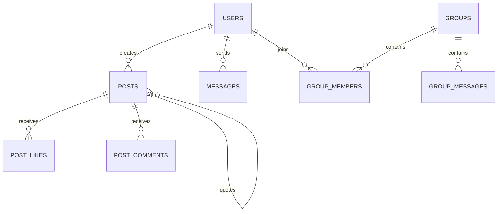

# Technical Architecture Document — ChattingApp

This Technical Architecture Document serves as the engineering blueprint for **ChattingApp**. It defines the chosen tech stack, file layout, database schema, and environment configurations to ensure a robust, scalable, and secure deployment.

---

## 1. Tech Stack & Engineering Rationale

| Layer | Technology | Version | Rationale |
| --- | --- | --- | --- |
| **Backend Framework** | FastAPI | `^0.104.0` | Async first, automatic openAPI docs, excellent performance for WebSockets. |
| **ASGI Web Server** | Uvicorn | `^0.24.0` | High-performance, lightweight ASGI server for running FastAPI. |
| **Database ORM** | SQLAlchemy | `^2.0.23` | Async capabilities, robust query generation, fully compatible with SQLite & Postgres. |
| **Production Database** | PostgreSQL | `^16` | Relational integrity, PostGIS spatial queries (ready), JSONB payload support. |
| **Testing Database** | SQLite | In-Memory / File | Zero-config, fast setup, fully compatible with SQLAlchemy dialect testing. |
| **Caching & Pub/Sub** | Redis | `^7` | Fast caching, room-scaling WebSocket event fanout, and background task brokering. |
| **Frontend Framework** | React (TS) / Vite | `^5` / `^18` | Type safety, rapid hot-module reloading, lightweight build bundle optimized for Capacitor. |
| **State Management** | Zustand | `^4.5` | Ultra-simple, decoupled global state management with persistent storage middleware. |
| **Native Wrapper** | Capacitor | `^5.7` | Standard web-to-native wrapping, cross-platform build pipelines, local file system hooks. |

---

## 2. File & Folder Structure

The ChattingApp project is structured as a monorepo containing distinct directories for the backend api services, frontend web interfaces, and native wrappers:

```
ChattingApp/
├── .github/workflows/          # CI/CD pipelines (Lint, pytest, smoke tests, deploy)
├── docs/                       # Architecture plans, audits, blueprints, and runbooks
│   └── blueprints/             # System specifications and blueprints
├── backend/                    # FastAPI Backend Project
│   ├── alembic/                # Database migration scripts
│   ├── app/
│   │   ├── core/               # Middleware, config settings, security headers
│   │   ├── database/           # Engine, connection setup, query event listeners
│   │   ├── models/             # SQLAlchemy declarative models
│   │   ├── routes/             # REST endpoint routers
│   │   ├── schemas/            # Pydantic schemas for request/response validation
│   │   ├── services/           # Business logic layer
│   │   ├── utils/              # Helper utilities (Geo, Privacy)
│   │   ├── websocket/          # WebSocket controllers & Redis event broker
│   │   └── workers/            # Celery/RQ task definitions
│   ├── tests/                  # Pytest unit & integration tests
│   ├── tools/                  # Smoke testing, link checker, and migration validation scripts
│   ├── Dockerfile
│   └── requirements.txt
├── frontend/                   # React / TypeScript Frontend Project
│   ├── android/                # Native Android studio workspace wrapper
│   ├── src/
│   │   ├── components/         # Reusable UI elements (Sidebar, MediaUploader)
│   │   ├── features/           # Feature pages (Admin dashboard, Feed, Chats, Groups)
│   │   ├── layout/             # Navigation bars, layout shells
│   │   ├── lib/                # IndexedDB wrapper (localDb.ts), api client
│   │   ├── pages/              # Routing entry pages (Settings, Feed, Login)
│   │   ├── App.tsx             # Routing configuration
│   │   └── main.tsx            # Global CSS imports and React entry point
│   ├── capacitor.config.ts     # Capacitor wrapper configuration
│   ├── package.json
│   └── vite.config.ts
└── docker-compose.yml          # Local multi-replica orchestration profile
```

---

## 3. Database Schema

All database models inherit from `declarative_base()` and are typed using SQLAlchemy column definitions. Below are the key tables, fields, and relationships.



### 1. `users` Table
Stores primary user attributes. Authenticators are validated through Firebase.
- `id`: `UUID` (Primary Key, default `uuid4`)
- `firebase_uid`: `VARCHAR(128)` (Unique, Index)
- `username`: `VARCHAR(50)` (Unique)
- `email`: `VARCHAR(100)` (Unique)
- `is_verified`: `BOOLEAN` (default `FALSE`)
- `created_at`: `TIMESTAMP` (default `now()`)

### 2. `posts` Table
Stores social feed posts, supporting reposts and nested quote posts.
- `id`: `UUID` (Primary Key)
- `user_id`: `UUID` (Foreign Key -> `users.id`)
- `content`: `TEXT`
- `media_urls`: `JSONB` (Array of static URLs)
- `quoted_post_id`: `UUID` (Nullable, Foreign Key -> `posts.id` self-reference)
- `repost_of_id`: `UUID` (Nullable, Foreign Key -> `posts.id` self-reference)
- `created_at`: `TIMESTAMP`

### 3. `messages` Table
Direct messaging history.
- `id`: `UUID` (Primary Key)
- `sender_id`: `UUID` (Foreign Key -> `users.id`)
- `recipient_id`: `UUID` (Foreign Key -> `users.id`)
- `content`: `TEXT` (Encrypted)
- `media_url`: `TEXT` (Nullable)
- `is_read`: `BOOLEAN` (default `FALSE`)
- `created_at`: `TIMESTAMP`

### 4. `groups` Table
Group channels and configuration.
- `id`: `UUID` (Primary Key)
- `name`: `VARCHAR(100)`
- `description`: `TEXT`
- `owner_id`: `UUID` (Foreign Key -> `users.id`)
- `is_verified`: `BOOLEAN` (default `FALSE`)
- `created_at`: `TIMESTAMP`

### 5. `group_members` Table
Associates users with groups and manages roles.
- `id`: `UUID` (Primary Key)
- `group_id`: `UUID` (Foreign Key -> `groups.id`)
- `user_id`: `UUID` (Foreign Key -> `users.id`)
- `role`: `VARCHAR(20)` (Owner, Admin, Moderator, Member)
- `joined_at`: `TIMESTAMP`

### 6. `feed_event_chain` Table
Tamper-evident log of feed activity using cryptographic hash chaining.
- `id`: `UUID` (Primary Key)
- `event_type`: `VARCHAR(50)` (post, comment, like)
- `event_id`: `UUID`
- `user_id`: `UUID`
- `previous_hash`: `VARCHAR(64)`
- `current_hash`: `VARCHAR(64)`
- `created_at`: `TIMESTAMP`

### 7. `user_feed_controls` Table
User-specific feed settings.
- `user_id`: `UUID` (Primary Key, Foreign Key -> `users.id`)
- `muted_words`: `JSONB` (Array of strings)
- `ranking_mode`: `VARCHAR(20)` (chronological, engagement)
- `sensitive_content_hidden`: `BOOLEAN` (default `TRUE`)
- `data_saver_mode`: `BOOLEAN` (default `FALSE`)

---

## 4. Environment & Configuration Variables

The backend loads configuration settings from `.env` or system variables using Pydantic Settings.

| Variable Name | Required | Default | Purpose / Safety Note |
| --- | --- | --- | --- |
| `APP_ENV` | Yes | `development` | Gates debugging, trust headers, and database pooling class. |
| `DATABASE_URL` | Yes | N/A | PostgreSQL connection string. Must use `postgresql+asyncpg` for async drivers. |
| `READ_REPLICA_DATABASE_URL` | No | Null | Directs read-only operations to a replica to optimize performance. |
| `REDIS_URL` | No | Null | Redis host connection. Enables distributed WebSocket fanout if configured. |
| `FIREBASE_PROJECT_ID` | Yes | N/A | Google/Firebase project ID used for validating incoming JWTs. |
| `FIREBASE_CREDENTIALS_PATH` | Yes | `./firebase_key.json` | Path to Google Service Account Key JSON. Keep out of source control. |
| `JWT_SECRET_KEY` | Yes | N/A | Secret key for signing fallback sessions. Minimum 32 characters. |
| `AES_KEY` | Yes | N/A | Web Crypto / Backend AES key for backup encryption. Must be base64url encoded. |

---

## 5. Embedded Technical Architecture Prompt
To generate or iterate on this Technical Architecture document, use the following prompt:
> "Act as a senior software architect who has built and scaled multiple SaaS products. Based on my app idea, create a complete Technical Architecture Document. It should include the recommended tech stack with reasoning for each choice, the complete file and folder structure of the project, the full database schema with all tables, fields, and relationships explained in plain English, and any environment variables or configuration notes I need to be aware of before I start building. My app idea is a secure, real-time social chatting application (FastAPI backend with PostgreSQL, Redis pub/sub broker, RQ workers, React with Zustand, and Capacitor for Android wrapping)."
