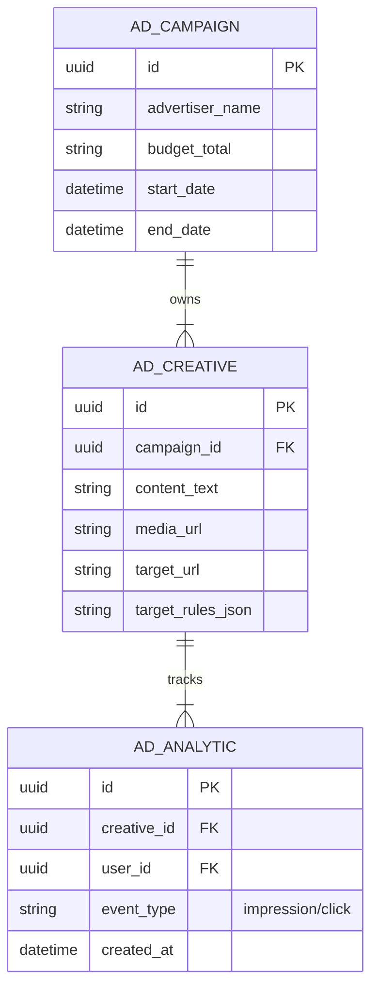

# Native Ad & Monetization System

This document outlines the advertisement infrastructure, target parameters, placement locations, and analytics schemas for ChattingApp.

---

## 1. Ad Placements & Sponsored Posts

To maintain a premium UX without causing user friction, ads are delivered as native items:
- **Sponsored Posts**: Rendered inside the user's social feed, matching the visual structure of user posts with a small "Sponsored" trust indicator.
- **Promoted Accounts**: Suggested to users on the Search/Explore screen.
- **Rules of Placement**: Ads must not exceed a ratio of 1 ad post per 10 organic posts.

---

## 2. Targeting Logic & Ad Service

Ads are fetched via `GET /api/v1/ads/placement` and target users based on:
1. **User Lists & Interests**: Dynamically matched against the user's interest graph compiled in `FeedService._build_interest_profile`.
2. **Hashtag Context**: If a user searches or views a specific hashtag (e.g. `#tech`), relevant tech ads are prioritized.
3. **Geo-Location**: Approximate targeting based on client IP reputation database values.

---

## 3. Database Schema Blueprint

- **Impression Tracking**: The frontend fires a lightweight analytics event `POST /api/v1/ads/track` when an ad creative is rendered in the active viewport (using the browser's `IntersectionObserver` API).
- **Ad Moderation**: Advertisers upload creatives through an approval gateway. The Admin Operations Panel verifies ad creatives before they enter active auction pools.
