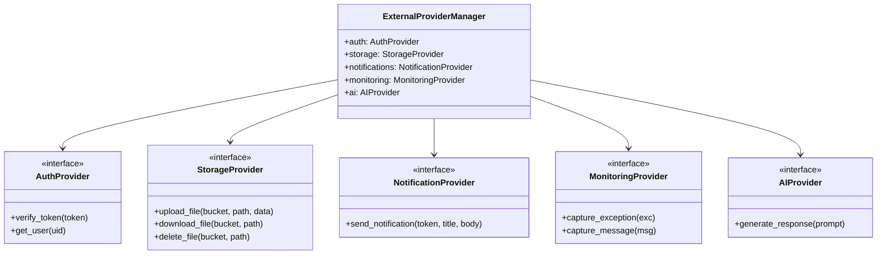

# Centralized Provider Management Architecture

This document describes the design and usage of the centralized external services provider abstraction layers in ChattingApp.

---

## 1. Architectural Philosophy

To prevent third-party SDK lock-in and simplify testing, all external APIs are abstracted behind unified protocols. This ensures:
- **Centralized Management**: All integrations are initialized, verified, and configured in a single module ([providers.py](file:///c:/Users/Vipin/OneDrive/Desktop/WebAplications/ChattingApp/backend/app/core/providers.py)).
- **Interchangeability**: Switching from Firebase to Supabase or from AWS S3 to local storage requires zero modifications to application controllers or routes.
- **Resilient Fallbacks**: If an external cloud service is unconfigured or encounters downtime, the system automatically falls back to local or mock implementations.

---

## 2. Provider Protocol Mapping

We have defined python `Protocol` objects for five distinct service categories:

---

## 3. Dynamic Switching Rules

The active implementation is determined dynamically at runtime based on environment variables:

| Category | Primary Implementation | Environment Trigger | Fallback Implementation |
| :--- | :--- | :--- | :--- |
| **Authentication** | `FirebaseAuthProvider` | `FIREBASE_PROJECT_ID` | `SupabaseAuthProvider` (Verifies local JWT) |
| **Storage** | `S3StorageProvider` | `AWS_S3_BUCKET` | `LocalStorageProvider` (Saves to `/uploads`) |
| **Notifications** | `FirebaseNotificationProvider` | `FIREBASE_PROJECT_ID` | `LocalNotificationProvider` (Logs to console) |
| **Monitoring** | `SentryMonitoringProvider` | `SENTRY_DSN` | `LocalMonitoringProvider` (Logs locally) |
| **AI Content** | `GeminiAIProvider` | `GEMINI_API_KEY` | `MockAIProvider` (Mock responses) |
