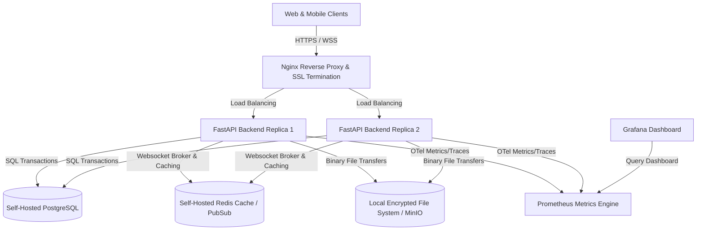

# Zero-Cost Production Deployment Strategy

This document details the production-ready infrastructure blueprint for deploying the ChattingApp platform without relying on paid proprietary services. Every layer of the stack utilizes production-grade open-source or free self-hosted technologies.

---

## 1. System Architecture Diagram



---

## 2. Infrastructure Component Matrix

| Infrastructure Tier | Production Software | License | Role / Context |
| :--- | :--- | :--- | :--- |
| **Web Server / Proxy** | Nginx | BSD-like | Handles TLS termination, Gzip compression, rate limiting, and static file hosting. |
| **Backend runtime** | Python / Uvicorn | Python License | Lightweight ASGI server replica stack. |
| **Database Store** | PostgreSQL 16+ | PostgreSQL | Primary relational database for transactions, relational models, and event chains. |
| **Real-time Broker** | Redis 7+ | RSALv2/SSPL | WebSocket state synchronization (pub/sub) and ephemeral API caching. |
| **Media Storage** | Local Encrypted Storage / MinIO | AGPLv3 (MinIO) | S3-compatible self-hosted file vault for uploads. |
| **MFA & Auth Fallback**| Supabase JWT Fallback | Apache 2.0 | Complete open-source fallback auth flow for user accounts when Firebase is offline. |
| **Metrics Collect** | Prometheus | Apache 2.0 | Aggregates application and telemetry metrics via `prometheus_client` exporter. |
| **Dashboards** | Grafana | AGPLv3 | Graphical visualizer for resource monitors and application errors. |

---

## 3. High Availability Configuration

### A. Backend Services
- Deploy FastAPI as multiple stateless replicas managed by a free container orchestrator (e.g., Docker Compose on standard virtual private servers, or HashiCorp Nomad / k3s).
- Run each Uvicorn process behind a unified Nginx load balancer.

### B. Redis WebSockets Fanout
- Configure `settings.TASK_QUEUE_BACKEND = "redis"` and `settings.REDIS_URL`.
- The `RedisBroker` class handles WebSocket message propagation between replicas:
  - When User A connects to replica 1 and User B connects to replica 2, any chat message sent by User A to User B is published to the Redis channel `chattingapp:chat`.
  - Replica 2 receives the Redis broadcast and pushes the message frame down User B's active WebSocket connection.

---

## 4. Secure Media Storage Topology

Avoid using paid cloud object storage (AWS S3, Google Cloud Storage, Azure Blob). Utilize the self-hosted media storage architecture:

1. **Local Disk Vaulting**:
   - Save files directly to a secure volume mapped on the host filesystem (`/var/data/uploads`).
   - Files are stored using cryptographic hashes (SHA-256) as filenames to avoid path injection and prevent duplicated files.
2. **S3-Compatible Object Store (MinIO)**:
   - For multi-instance scaling, run a self-hosted instance of **MinIO**.
   - MinIO provides an S3-compatible API that maps directly to the existing `boto3` integration without modification.

---

## 5. Security & Isolation Policies

- **Nginx Reverse Proxy**:
  - Set up `LimitReq` zones to block brute-force scanners and limit API abuse.
  - Inject security headers (`Strict-Transport-Security`, `Content-Security-Policy`, `X-Content-Type-Options`, `X-Frame-Options`).
- **Encryption at Rest**:
  - Secure the underlying database and file storage systems using standard Linux LUKS (Linux Unified Key Setup) partition encryption.
- **Firebase/Supabase Hybrid Fallback**:
  - Keep users authenticated using Supabase local tokens even when Firebase services are unreachable.

---

## 6. Maintenance & Backup Plan

Automate backups using standard cron schedules executing shell scripts:

### PostgreSQL Backup (`pg_backup.sh`)
```bash
#!/usr/bin/env bash
BACKUP_DIR="/var/backups/postgres"
FILE_NAME="chattingapp_db_$(date +%Y%m%d_%H%M%S).sql.gz"
mkdir -p "$BACKUP_DIR"
pg_dump -h localhost -U postgres chattingapp | gzip > "$BACKUP_DIR/$FILE_NAME"
# Retain backups for 14 days
find "$BACKUP_DIR" -type f -mtime +14 -name "*.sql.gz" -delete
```

### Media Storage Sync (`media_backup.sh`)
```bash
#!/usr/bin/env bash
BACKUP_DIR="/var/backups/media"
mkdir -p "$BACKUP_DIR"
# Archive uploads directory
tar -czf "$BACKUP_DIR/media_$(date +%Y%m%d).tar.gz" -C /var/data/uploads .
# Delete older archives
find "$BACKUP_DIR" -type f -mtime +14 -name "*.tar.gz" -delete
```
