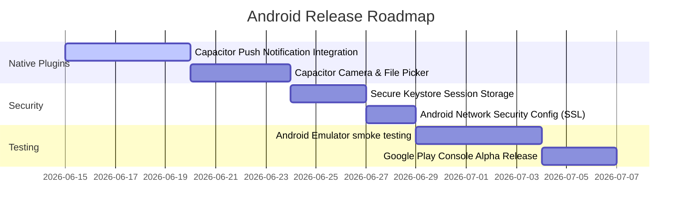

# Android App Readiness Evaluation

This report evaluates the readiness of the ChattingApp platform for compile-time packaging and native deployment on Android devices using Capacitor.

---

## 1. Subsystem Readiness Matrix

| Subsystem | Readiness Status | Findings & Risks |
| :--- | :--- | :--- |
| **PWA Manifest** | **READY** | Correct colors, standalone modes, and asset icons are declared. |
| **API Endpoints** | **READY** | Strict REST endpoints and HTTPS/WSS protocols ensure compatibility with Android's network security config. |
| **Auth Flow** | **READY** | Supports standard OAuth redirects and fallback tokens. |
| **Push Notifications** | **PARTIALLY READY** | FCM push notifications are configured in the backend, but require integration with Capacitor's PushNotifications native plugin on the frontend. |
| **Offline Support** | **READY** | All offline message queues and feeds are successfully managed via IndexedDB. |
| **Local Storage** | **READY** | Secure key storage and local IndexedDB database structures run reliably on WebKit/WebView. |
| **Media Architecture** | **PARTIALLY READY** | Local device media upload requires integration with the Capacitor Camera/Filesystem native APIs for file picking. |
| **Sync Engine** | **READY** | Automatic queue flushing and conflict reconciliation engine are active. |

---

## 2. Roadmap to Android Release

To achieve production-grade Android publication, the following tasks must be completed:

### Key Milestones:
1. **Capacitor Native Bridge Setup**: Bind the frontend UI's upload and push notifications to Capacitor's `@capacitor/push-notifications` and `@capacitor/camera` native plugins.
2. **Secure Keystore Storage**: Store session refresh tokens in the Android Keystore using `@capacitor-community/secure-storage` instead of local storage.
3. **Google Play Console Alpha Testing**: Compile the debug APK, sign it with a release key, and release to alpha testers.
