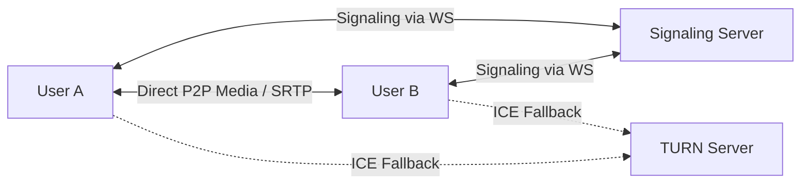

# WebRTC Production Readiness & Media Calling Audit

This document audits the WebRTC peer-to-peer and group calling subsystem for production readiness. It outlines signaling flows, STUN/TURN deployment needs, codec negotiation, and fallback strategies.

## Topology & Media Routing

For direct calls, ChattingApp implements a hybrid Peer-to-Peer (P2P) mesh model for maximum privacy and minimal server load, with plans to introduce a Selective Forwarding Unit (SFU) for calls with more than 4 participants:



### 1. Signaling Protocol
* **Channel**: Secure WebSockets under `/api/v1/calls/signal`.
* **Flow**:
  1. **Initiate**: Caller sends an `offer` message containing the local Session Description Protocol (SDP) offer.
  2. **Route**: Signaling server resolves the recipient's connection status and forwards the SDP offer.
  3. **Respond**: Callee generates an SDP `answer` and routes it back.
  4. **ICE Exchange**: Both peers asynchronously gather and swap ICE (Interactive Connectivity Establishment) candidates until media connectivity is established.

### 2. NAT Traversal (STUN/TURN)
In real-world networks, up to **15-20%** of call setups require a TURN (Traversal Using Relays around NAT) relay because symmetric NAT routers prevent direct P2P connections.
* **STUN Server**: Google public STUNs (`stun:stun.l.google.com:19302`) are used for simple NAT discovery during development.
* **TURN Server (Production)**: Deploy [Coturn](https://github.com/coturn/coturn) on a dedicated compute node with a public IP and high-bandwidth capability.
* **ICE Configurations**:
  ```json
  {
    "iceServers": [
      { "urls": "stun:stun.l.google.com:19302" },
      {
        "urls": "turn:turn.chattingapp.com:3478",
        "username": "dynamic-webrtc-user",
        "credential": "secure-secret-token"
      }
    ]
  }
  ```

### 3. Media Cryptography & Security
* **DTLS-SRTP**: WebRTC strictly mandates DTLS (Datagram Transport Layer Security) and SRTP (Secure Real-time Transport Protocol) for key exchange and media encryption.
* **Signaling Security**: All SDP exchanges and ICE candidates are encapsulated inside a secure WS connection (`wss://`).

### 4. Native App Capabilities (Capacitor/Android)
To bundle the React client as an Android application via Capacitor:
* **Permissions**: Access to Camera (`android.permission.CAMERA`) and Microphone (`android.permission.RECORD_AUDIO`) is requested dynamically.
* **WebView WebRTC Support**: Chrome-based WebViews in Android 5.0+ natively support the WebRTC API, removing the need for heavy custom native WebRTC wrappers.
