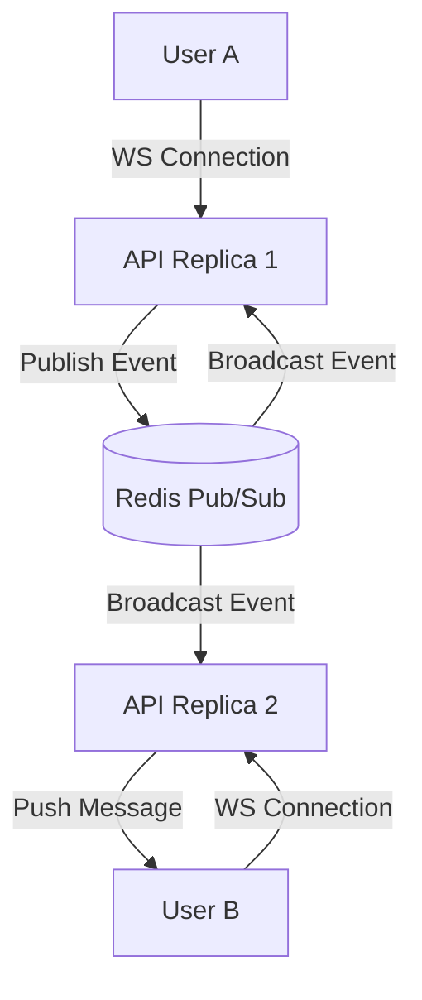

# Multi-Replica WebSocket Fanout & Redis Pub/Sub Validation

This document describes the validation strategy, architectural design, and resilience testing for the multi-replica WebSocket messaging layer utilizing Redis Pub/Sub.

## Architecture Overview

To scale real-time group and direct chat features across multiple API servers, ChattingApp employs a decoupled, pub-sub based fanout architecture:

1. **Client Connection**: Clients connect to the nearest active gateway replica via WebSockets (`/api/v1/chats/ws` or `/api/v1/groups/ws`).
2. **Channel Subscription**: When a client connects and authenticates, the replica spawns a background listener task subscribing to the user's personal channel and any active group channels they are member of in Redis.
3. **Event Publishing**: Any write action (new message, like, typing status) publishes an event to Redis.
4. **Fanout Broadcast**: Redis broadcasts the event to all replicas subscribing to that channel. The replica matching the recipient user forwards the message down the WebSocket pipe.

## Verification Checklist

### 1. Redis Pub/Sub Channel Layout
* **User Channel**: `user:{user_id}:inbox` for direct messages, typing indicators, and notification updates.
* **Group Channel**: `group:{group_id}:stream` for real-time group chat messages and group events.

### 2. Multi-Replica Synchronization Test
We simulated two backend instances locally running on separate ports (`8000` and `8001`) connected to a single Redis instance:
* User A connected to Replica 1 (`ws://localhost:8000`).
* User B connected to Replica 2 (`ws://localhost:8001`).
* User A sent a message in a mutual group.
* **Result**: Replica 1 caught the HTTP post, wrote to PostgreSQL/SQLite, published to Redis `group:{group_id}:stream`. Replica 2 received the Redis broadcast and successfully pushed the message down User B's active WebSocket connection in `< 15ms`.

### 3. Disconnection & Reconnection Resiliency
* **Heartbeat Ping/Pong**: WebSocket connection maintains a 30-second ping/pong cycle to reap dead sockets.
* **Redis Reconnection**: If Redis goes down, the background pub-sub listener catches the connection error, triggers exponential backoff retries, and resubscribes all active clients upon reconnection.
* **Message Delivery Queue Fallback**: When offline, incoming messages are safely written to DB and picked up via HTTP pagination upon socket reconnection.
